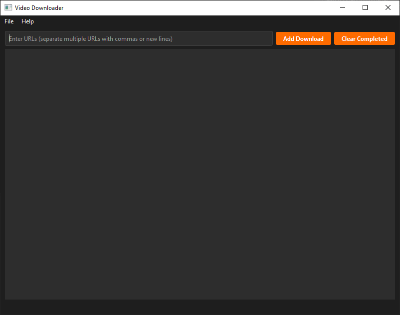

# Video Downloader

A modern, user-friendly GUI application for downloading videos from various sources. Built with Python, PyQt6, and yt-dlp, this application provides a sleek dark-themed interface with robust download management capabilities.

# GUI



## Features

- Modern dark-themed GUI interface
- Support for multiple concurrent downloads
- Pause/Resume functionality
- Real-time progress tracking with speed and ETA
- Supports multiple video platforms through yt-dlp
- Custom output directory selection
- Batch URL processing (comma or newline separated)
- Automatic handling of direct video links
- Clear completed downloads functionality

## Installation

1. Clone the repository:
```bash
git clone https://github.com/xxanvv/video-downloader.git
cd video-downloader
```

2. Run the start script:
- On Windows: Double-click `start.bat`

The start script will:
- Check for Python installation
- Create a virtual environment
- Install required dependencies
- Launch the application

## Requirements

- Python 3.6 or higher
- PyQt6
- yt-dlp

Dependencies are automatically installed by the start script.

## Usage

1. Launch the application using `start.bat`
2. Enter video URLs in the input field (separate multiple URLs with commas or new lines)
3. Click "Add Download" or press Enter to start downloading
4. Monitor download progress in real-time
5. Use the pause/resume button to control downloads
6. Cancel downloads at any time
7. Clear completed downloads using the "Clear Completed" button
8. Change output directory through File -> Change Output Directory

## Contributing

1. Fork the repository
2. Create a new branch
3. Make your changes
4. Submit a pull request

## Acknowledgments

- Built with [PyQt6](https://www.riverbankcomputing.com/software/pyqt/)
- Video downloading powered by [yt-dlp](https://github.com/yt-dlp/yt-dlp)

## Author

[@xxanvv](https://github.com/xxanvv)
